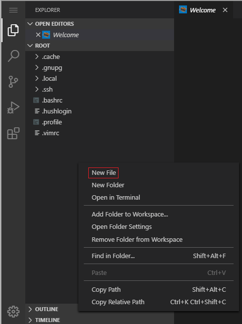
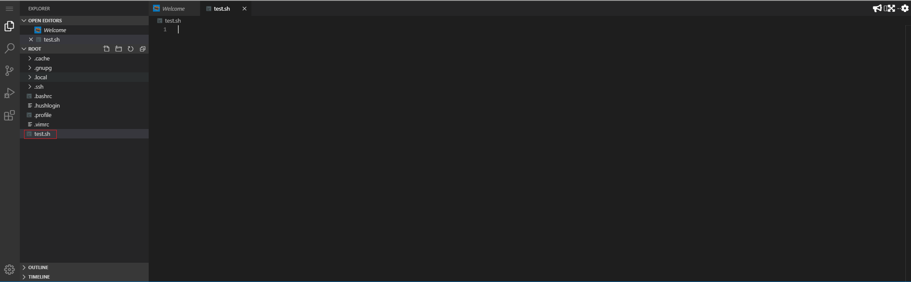

演習回答例(エディタでファイルを作成して実行)  
## シェルスクリプトのファイル作成(空ファイル)  

エディタのROOT上で右クリックをして"New file"をクリック。  
ファイル名に"test.sh"と入力してファイルを作成。  

  



## シェルスクリプトの内容書き込み  
作成したファイルにエディタから下の内容を書き込む  

```
#!/bin/bash
echo "Hello World"
```

## シェルスクリプトの実行(bashで実行する場合)  

`bash test.sh`{{execute}}

以下の内容がターミナル上に出力されていることを確認  

```
Hello World
```

## シェルスクリプトの実行(実行権限をつけて実行する場合)

実行権限を付与  

`chmod 755 test.sh`{{execute}}

実行  
`./test.sh`{{execute}}